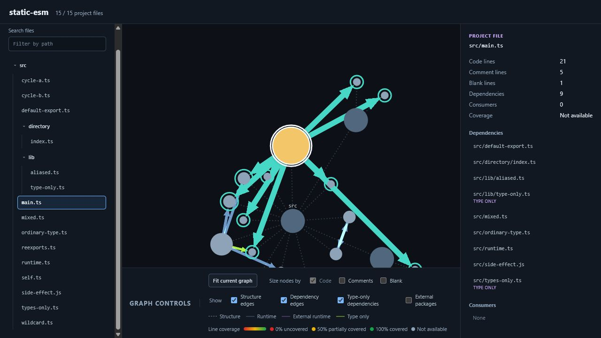

# Show Me

Show Me generates an interactive map of a JavaScript or TypeScript project. It analyzes project files, static ESM dependencies, pnpm workspace packages, external packages, line counts, and optional test coverage.

The output is one self-contained HTML file. Open it locally, share it, or publish it as a static page. Source code is not embedded in the report.

[Explore this codebase in the live GitHub Pages report](https://guillaume-docquier.github.io/show-me/)



## Install

Run Show Me without installing it:

```shell
pnpm dlx @guillaume-docquier/show-me .
```

Or install it globally to use the shorter command:

```shell
pnpm add --global @guillaume-docquier/show-me
show-me .
```

## Usage

```text
show-me [project-path] [options]
```

Analyze the current directory and write `show-me.html`:

```shell
show-me
```

Analyze another project and choose the output file:

```shell
show-me ../my-app --output reports/dependencies.html
```

Use an explicit Istanbul or LCOV coverage report:

```shell
show-me . --coverage coverage/coverage-final.json
show-me . --coverage coverage/lcov.info
```

Exclude generated files while keeping the default test exclusions:

```shell
show-me . --exclude "*.test.*" --exclude "*.spec.*" --exclude "*.generated.*"
```

Show Me writes the report but does not open it automatically.

## Command options

| Argument or option    | Description                                                    | Default                                            |
| --------------------- | -------------------------------------------------------------- | -------------------------------------------------- |
| `[project-path]`      | Project directory to analyze.                                  | Current directory                                  |
| `--output <path>`     | HTML report path, relative to the invocation directory.        | `show-me.html` in the invocation directory         |
| `--coverage <path>`   | One Istanbul JSON or LCOV report.                              | Automatically discover conventional coverage files |
| `--exclude <pattern>` | Replace all file exclusion patterns. Repeat for more patterns. | `*.test.*` and `*.spec.*`                          |
| `-h`, `--help`        | Print command help.                                            |                                                    |
| `-v`, `--version`     | Print the installed version.                                   |                                                    |

When `--coverage` is omitted, Show Me looks for these files at the project root and at package roots:

1. `coverage/coverage-final.json`
2. `coverage/lcov.info`

The first file found at each root is used. If no coverage file exists, the report is generated without coverage.

## Configuration

Create `show-me.config.json` at the analyzed project root to keep project-specific settings. The file accepts JSONC comments and trailing commas.

```jsonc
{
  // This is the complete exclusion list.
  "exclude": ["*.test.*", "*.spec.*", "*.generated.*"],
}
```

| Option    | Type       | Default                    |
| --------- | ---------- | -------------------------- |
| `exclude` | `string[]` | `["*.test.*", "*.spec.*"]` |

Configuration values replace defaults. CLI values replace configuration values. Arrays are not merged, so passing only `--exclude "*.generated.*"` includes test and spec files. Set `"exclude": []` to disable the default test exclusions.

Exclusion patterns use case-insensitive gitignore syntax against forward-slash, project-relative paths. A pattern without a slash matches a basename anywhere. A leading slash anchors the pattern at the project root. Negated patterns are not supported.

Show Me also respects `.gitignore` files and always skips `.git`, `.nyc_output`, `build`, `coverage`, `dist`, `node_modules`, and `out` directories. TypeScript declaration files and symbolic links are skipped.

## Using the report

The report lets you:

- search and select files from the project tree;
- inspect dependencies, consumers, line counts, and coverage;
- show or hide structure, runtime, type-only, and external-package relationships;
- filter pnpm workspace packages;
- size nodes by code, comment, and blank lines;
- pan, zoom, and fit the graph.

## Feedback and contributions

Have an idea? [Open an issue](https://github.com/Guillaume-Docquier/show-me/issues) to suggest an improvement or feature. Contributions are welcome. See [CONTRIBUTING.md](./CONTRIBUTING.md) and the [documentation map](./docs/README.md).

## AI disclosure

This project is vibe coded. If it gets traction, I will fix and refactor it.
