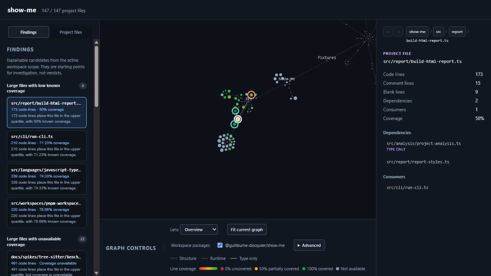

# Show Me

Show Me generates an interactive map of a JavaScript or TypeScript project. It analyzes project files, static ESM dependencies, pnpm workspace packages, external packages, line counts, and optional test coverage.

The output is one self-contained HTML file. Open it locally, share it, or publish it as a static page. Source code is not embedded in the report.

[Explore this codebase in the live GitHub Pages report](https://guillaume-docquier.github.io/show-me/)



## Install

Run Show Me without installing it:

```shell
pnpm dlx @guillaume-docquier/show-me .
```

Or install it globally to use the shorter command:

```shell
pnpm add --global @guillaume-docquier/show-me
show-me .
```

## Usage

```text
show-me [project-path] [options]
```

Analyze the current directory and write `show-me.html`:

```shell
show-me
```

Analyze another project and choose the output file:

```shell
show-me ../my-app --output reports/dependencies.html
```

Use an explicit Istanbul or LCOV coverage report:

```shell
show-me . --coverage coverage/coverage-final.json
show-me . --coverage coverage/lcov.info
```

Exclude generated files while keeping the default test exclusions:

```shell
show-me . --exclude "*.test.*" --exclude "*.spec.*" --exclude "*.generated.*"
```

Show Me writes the report but does not open it automatically.

## Command options

| Argument or option    | Description                                                    | When omitted                                         |
| --------------------- | -------------------------------------------------------------- | ---------------------------------------------------- |
| `[project-path]`      | Project directory to analyze.                                  | Current directory                                    |
| `--output <path>`     | HTML report path, relative to the invocation directory.        | Configured `output`, then `show-me.html`             |
| `--coverage <path>`   | One Istanbul JSON or LCOV report.                              | Configured `coverage`, then automatic discovery      |
| `--exclude <pattern>` | Replace all file exclusion patterns. Repeat for more patterns. | Configured `exclude`, then `*.test.*` and `*.spec.*` |
| `-h`, `--help`        | Print command help.                                            |                                                      |
| `-v`, `--version`     | Print the installed version.                                   |                                                      |

When neither `--coverage` nor configured `coverage` is present, Show Me looks for these files at the project root and at package roots:

1. `coverage/coverage-final.json`
2. `coverage/lcov.info`

The first file found at each root is used. If no coverage file exists, the report is generated without coverage.

## Configuration

Create `show-me.config.json` at the analyzed project root to keep project-specific settings. The file accepts JSONC comments and trailing commas.

```jsonc
{
  // Relative configured paths start at the analyzed project root.
  "output": "reports/dependencies.html",
  "coverage": "coverage/lcov.info",

  // This is the complete exclusion list.
  "exclude": ["*.test.*", "*.spec.*", "*.generated.*"],
}
```

| Option     | Type       | Default                                     | CLI override |
| ---------- | ---------- | ------------------------------------------- | ------------ |
| `output`   | `string`   | `show-me.html` in the invocation directory  | `--output`   |
| `coverage` | `string`   | Automatically discover conventional reports | `--coverage` |
| `exclude`  | `string[]` | `["*.test.*", "*.spec.*"]`                  | `--exclude`  |

Relative `output` and `coverage` paths in configuration are resolved from the analyzed project root. Relative CLI paths are resolved from the invocation directory. Each CLI value replaces the matching configuration value, and each configured value replaces its default.

Exclusion arrays are not merged, so passing only `--exclude "*.generated.*"` includes test and spec files. Set `"exclude": []` to disable the default test exclusions.

Exclusion patterns use case-insensitive gitignore syntax against forward-slash, project-relative paths. A pattern without a slash matches a basename anywhere. A leading slash anchors the pattern at the project root. Negated patterns are not supported.

Show Me also respects `.gitignore` files and always skips `.git`, `.nyc_output`, `build`, `coverage`, `dist`, `node_modules`, and `out` directories. TypeScript declaration files and symbolic links are skipped.

## Using the report

The report lets you:

- start in the `Overview` lens on the `Findings` tab, with the complete project explorer one click away on the `Project files` tab. The graph sizes files by code lines, colors them by coverage, keeps directory structure visible, and reveals only the hovered or selected file's direct dependencies;
- investigate large files with low or unavailable coverage, highest fan-out and fan-in, dependency cycles, and cross-workspace relationships. Findings show the raw facts behind each candidate and navigate through the same selection, centering, details, and history workflow as the graph;
- switch to the `Structure` lens for neutral file colors, containment edges, and relationship details without dependency arrows or focus decoration;
- open `Advanced` to customize file sizing and color, dependency display, type-only relationships, structure edges, and external packages. A changed preset is labeled `Custom`, and selecting a named lens restores its defaults without changing workspace scope;
- search project-file and directory paths with exact result counts while keeping the selected item reachable;
- expand directories independently from selecting them, with top-level directories expanded initially;
- select and center files or directories from the graph, project tree, breadcrumbs, or relationship lists;
- move backward and forward through selection history, and clear selection by clicking empty graph space;
- inspect dependencies, consumers, line counts, and coverage;
- hover project files, external packages, and directories to preview their labels and details without moving the camera or changing selection history;
- select a project file or external package to highlight its direct dependency neighborhood when the active presentation enables dependency focus;
- filter pnpm workspace packages;
- pan, zoom, and fit the graph.

Findings are investigation candidates, not claims that code is wrong. Cross-workspace relationships are not architecture violations unless an explicit rule says so. Coverage that is unavailable is kept separate from 0% coverage.

### Finding rankings

Each category initially shows five candidates. `Show all` reveals the complete list without changing its order. Project-tree search does not change findings. Workspace-package filters do.

| Category                              | Deterministic inclusion and ranking                                                                                                                                                                                                                                    |
| ------------------------------------- | ---------------------------------------------------------------------------------------------------------------------------------------------------------------------------------------------------------------------------------------------------------------------- |
| Large files with low known coverage   | Use the nearest-rank 75th-percentile code-line count as the inclusive large-file threshold, ignoring zero-code files. Include known coverage below 80%. Sort by coverage ascending, code lines descending, then path.                                                  |
| Large files with unavailable coverage | Use the same large-file threshold. Include files with no coverage value. Sort by code lines descending, then path.                                                                                                                                                     |
| Highest fan-out                       | Count distinct visible direct project-file dependencies, with runtime and type-only counts shown separately. Exclude zero. Sort by total descending, runtime descending, then path.                                                                                    |
| Highest fan-in                        | Count distinct visible project-file consumers, with runtime and type-only counts shown separately. Exclude zero. Sort by total descending, runtime descending, then path.                                                                                              |
| Dependency cycles                     | Find strongly connected components in the runtime graph and then the combined runtime and type-only graph. Suppress combined components already reported as runtime cycles. Rank runtime first, component size descending, then member paths. Self-dependencies count. |
| Cross-workspace relationships         | Group visible project-file dependencies by directed source and target workspace plus relationship kind. Sort by relationship count descending, workspace names, then relationship kind.                                                                                |

## Feedback and contributions

Have an idea? [Open an issue](https://github.com/Guillaume-Docquier/show-me/issues) to suggest an improvement or feature. Contributions are welcome. See [CONTRIBUTING.md](./CONTRIBUTING.md) and the [documentation map](./docs/README.md).

## AI disclosure

This project is vibe coded. If it gets traction, I will fix and refactor it.
