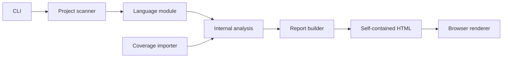

# Architecture Overview

Show Me is a command-line tool that analyzes a JavaScript or TypeScript project and writes a self-contained HTML report containing a directed file dependency graph.

This document describes the target architecture. The implementation is being built incrementally according to the [task roadmap](../tasks/README.md).

## Current implementation

Milestones 001 through 005 are complete. The CLI discovers supported project files, counts non-blank physical lines, analyzes static runtime ESM imports and re-exports through Oxc, optionally imports Istanbul line coverage, and writes a self-contained interactive graph report. The analysis, presentation, and renderer boundaries are operational and covered through Node and real-browser tests.

CLOC-style metrics, external packages, and workspace behavior remain planned rather than partially implemented.

## System flow

The boundaries have different responsibilities:

- The CLI parses command-line input, starts analysis, writes the report, and presents errors or completion information.
- Project scanning discovers candidate files without understanding their syntax.
- A language module turns project files into language-neutral file metrics, runtime dependency references, and diagnostics.
- Coverage importers translate supported coverage formats into language-neutral per-file coverage.
- The report builder converts the analysis into a browser presentation model and embeds it with the browser assets.
- The renderer consumes only the embedded presentation model. It does not parse source code, read the filesystem, or understand coverage formats.

## Planned initial product scope

The initial product:

- analyzes one JavaScript or TypeScript project with one root `tsconfig.json` or `jsconfig.json`;
- discovers executable `.js`, `.jsx`, `.mjs`, `.cjs`, `.ts`, `.tsx`, `.mts`, and `.cts` files;
- excludes TypeScript declaration files, non-code assets, and supported files whose basename contains `.test.` or `.spec.` case-insensitively, while marker-like directories and bare `test.ts` or `spec.ts` names remain included;
- counts non-blank physical lines, including comments;
- recognizes syntax-level runtime static ESM imports and re-exports;
- excludes explicitly type-only imports and re-exports;
- renders a flat, force-directed file graph without persistent node labels;
- optionally colors project file nodes using Istanbul line coverage; and
- writes one offline HTML file.

CommonJS, dynamic imports, external package nodes, CLOC-style line classification, pnpm workspaces, and richer visualization controls are planned as later milestones rather than partially supported in the first implementation.

## Package shape

The npm package is `@guillaume-docquier/show-me`. It exposes the `show-me` executable through its `bin` entry.

The repository remains one package until a concrete need justifies splitting it. Source directories should express the architectural boundaries without creating package-level ceremony.

## Dependency direction

The analysis model is the stable center of the application:

- Language-specific code depends on and produces the analysis model.
- Coverage-specific code depends on and enriches the analysis model.
- Report generation depends on the analysis model.
- The analysis model does not depend on Oxc, Sigma, Graphology, browser APIs, or CLI libraries.
- The renderer does not depend on Oxc, Node filesystem APIs, or project configuration.

This direction keeps a future Rust analyzer feasible: a replacement analyzer can produce the same conceptual data without changing report rendering.

## Error handling

Expected filesystem, parsing, resolution, coverage, and report-writing failures are returned as typed `Result` failures. Third-party exceptions are classified at their adapter boundary. Fatal exceptions are reserved for violated internal invariants and unrecoverable defects.

The CLI decides which implemented failures stop the command. Missing automatically discovered coverage is informational, while missing, unreadable, or invalid explicit coverage is an expected command failure.

## Related documentation

- [Analysis architecture](./analysis.md)
- [Static report and CLI](./static-report.md)
- [Testing strategy](./testing.md)
- [Performance guidance](./performance.md)
- [Architecture decisions](../adr/README.md)
- [Implementation roadmap](../tasks/README.md)
