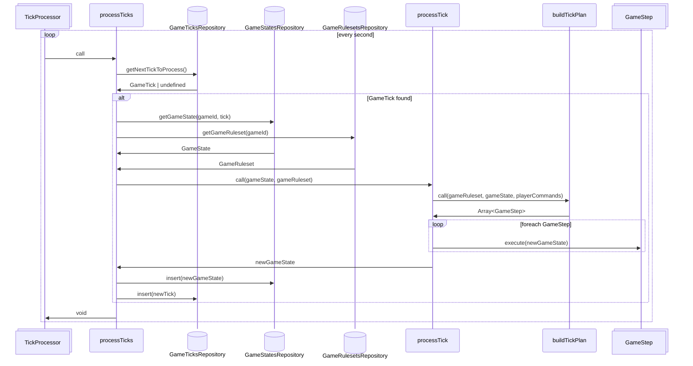

# Tick processing (target architecture)

The tick processing pipeline aims to be entirely data driven.

Every game will configure its ruleset, which defines:

- the enabled game mechanics (diplomacy, messaging, war, science, basic income, etc)
- the game mechanics attributes (treaty costs, messaging scope, warship damage multiplier, etc)
- every building, unit, etc, their costs, their stats and the actions they offer
- the order in which mechanics and actions should be resolved
- static game attributes (starting resources, solar system size, action count multiplier, tick rate, etc)

There will be presets for ease of use, but the idea is that every rule will be stored in the DB for each game.

Players will be able to tweak any setting at will.

The tick processing pipeline will:

- take as input the game state and ruleset
- determine non-player actions that will occur
- sort actions in the order that they should occur
- apply actions to the game state
- proceed to next tick

The goal of this is to be able to add / change the game mechanics with minimal changes to the tick processing.

To add a game mechanic, we only have to define the actions that this mechanic has, and implement each action. The rest should fit neatly into the pipeline.

For mechanics that introduce things that are already supported by the game (like new units, new buildings), then there is nothing to implement, just data to add.

Tweaking numbers or the order of actions should require 0 backend changes, only changes to the persisted ruleset.

